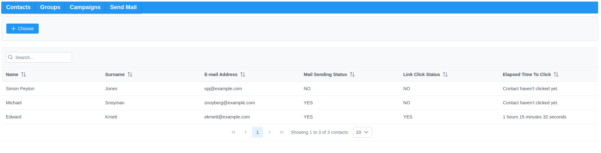
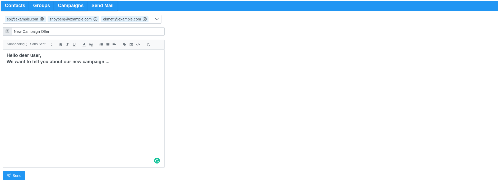

# Email Campaign Application 
A complex (!) structured online email app which lets you add contacts and send email to desired ones :blush:

## Get Started...
The project has both backend and fronted applications. 
Backend application is powered bv SpringBoot and frontend application was implemented as a React Application.

To actually build, run and start experiencing email campaign application please first consult to [backend documentation](https://github.com/AlperKocaman/Email-Campaign/tree/master/src) then consult to [frontend documentation](https://github.com/AlperKocaman/Email-Campaign/tree/master/fe_src).

## Tech Background
Keywords: `Spring Boot`, `Spring-Mail`, `PostgreSQL`, `JUnit`, `React`, `PrimeReact Library`

### Backend
Infrastructure implemented using `Spring Boot Data MVC` framework with using `Spring Mail`. For the testing purposes of backend `JUnit` and `Postman` has been utilized.

### Frontend
Client side is implemented as a react application using `JavaFX` in collaboration with `SpringBoot`. For the request chains `Axios` has been utilized.  

## Sample ScreenShots

